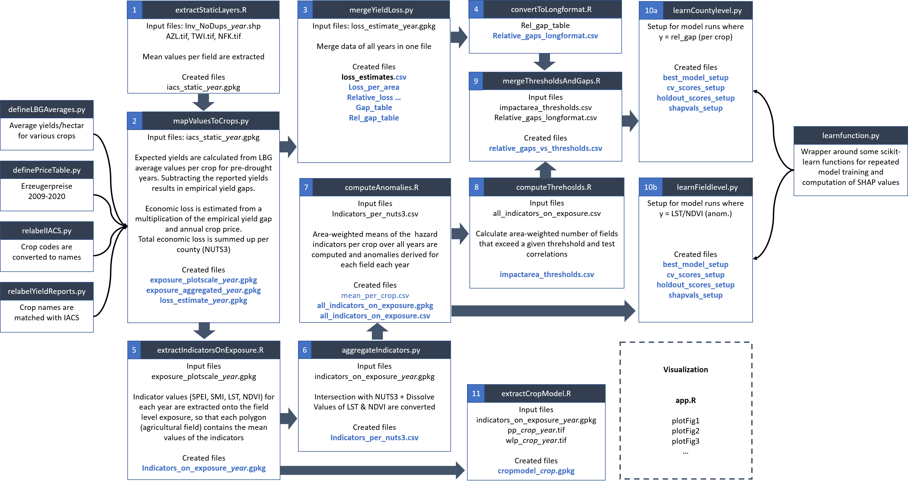

# brandenburg-drought-study
Scripts and data related to the journal paper: "Exploring drought hazard, vulnerability, and impacts to agriculture in Brandenburg"

Created during the transdisciplinary research project [CliWaC](https://www.cliwac.de/), funded by the [Einstein Foundation](https://www.einsteinfoundation.de/en/) and [Berlin University Alliance](https://www.berlin-university-alliance.de/en/index.html).

Some parts of the processing are coded in Python, others in R. Reasons for this mix are implementation details of specific operations. The flowchart visualizes in which order the scripts have been used to create the results described in the paper. In "data/processed" the results of the entire preprocessing chain are published. These files are sufficient to reproduce the machine learning part and the figures included in the main article. "app.R" creates an interactive data visualization (R-Shiny) to explore spatiotemporal patterns of drought-related indicators. It can be run locally.

Raw data and intermediate results are not uploaded due to file size. Most of the raw data is open data, and all sources have been cited to the best of our knowledge. Raw data comprises shapesfiles on crops from the Integrated Administration and Control System (IACS), tables on average crop yield per soil quality range (LBG) from non-drought years, farm level prices, and reported yields on county level, as well as a folder of rasters containing the raw indicator values: static layers (AZL, TWI, NFK), annual mid growing season means (LST, NDVI), and monthly values (SPEI, SMI). For consistency with the paper, indicator names in the code are also in uppercase.